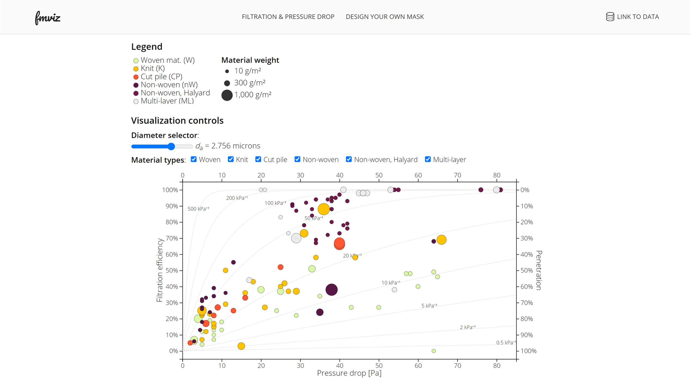

# Face mask filtration visualization 

### (FMVIZ)

Repository supporting the viz available at https://tsipkens.github.io/fmviz/. This viz examines the filtration properties of common materials, using the data from [Rogak et al][rogakfm]. Filtration and pressure drop are two of the most important properties of face masks. 

In the primary plot generated by this procedure, dashed lines correspond to line of constant quality, using the natural number as a base ane pressures in kPa. A good quality denotes a hybrid of good filtration while maintaining a lower pressure drop. 

For material codes, the first component denotes the material structure, such as **nW** for non-woven; followed by an optional **x\*** code to denote if multiple layers were used during the test (e.g., **x2** for two layers of the material); and finally an optional code denoting if a treatment was applied to the mask (i.e., **HS** for heat treatment, **IPA** for isopropyl alcohol treatments, **WD** for laundering, and **SW** for washing with soap and water).

A sample starting plot is shown below. The user can hover over the ciricles to see information on the material. 

[rogakfm]: https://arxiv.org/abs/2008.06001
